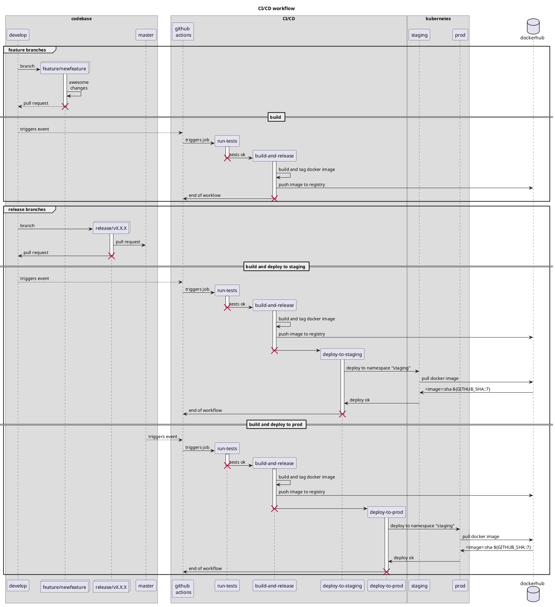

# Click Count application

[](https://travis-ci.org/xebia-france/click-count)

<!-- @import "[TOC]" {cmd="toc" depthFrom=2 depthTo=6 orderedList=false} -->

<!-- code_chunk_output -->

- [Requirements](#requirements)
- [Setup](#setup)
  - [Create a service account user](#create-a-service-account-user)
  - [Deploy the infra](#deploy-the-infra)
  - [Setup your AWS console user to work with EKS (optional)](#setup-your-aws-console-user-to-work-with-eks-optional)
- [CI/CD](#cicd)

<!-- /code_chunk_output -->


This java application is a revolutionary Click Counter brought to you by Click Paradise&trade;.

## Requirements

* terraform 0.12.13+ (or Docker)
* kubectl
* aws-cli
* GitHub CLI 1.4+

```bash
aws eks --region us-east-1 update-kubeconfig --name "terraform-eks-clickcount"
kubectl edit -n kube-system configmap/aws-auth
```

## Setup

Clone the repository.

```bash
git clone git@github.com:pssgoifo/click-count.git
cd click-count/
```

### Create a service account user

Using the AWS console or CLI, create a suitable service account user for terraform and safeguard the credentials.

### Deploy the infra

**First time only**, we create the terraform backend using a bootstrap module.

```bash
# Setup the AWS credentials
export AWS_ACCESS_KEY_ID=<access_key_id>
export AWS_SECRET_ACCESS_KEY=<access_key_secret>
export AWS_DEFAULT_REGION=<default_region>

# Deploy backend
cd infra/bootstrap/
terraform init
terraform plan
terraform apply
cd -
```

Deploy/update the infra

```bash
# Setup the AWS credentials
export AWS_ACCESS_KEY_ID=<access_key_id>
export AWS_SECRET_ACCESS_KEY=<access_key_secret>
export AWS_DEFAULT_REGION=<default_region>

# Deploy infra
cd infra/terraform/
terraform init
terraform plan
terraform apply
cd -

# @FIXME: deploy namespaces by hand until the token issue is fixed
aws eks --region us-east-1 update-kubeconfig --name "terraform-eks-clickcount"
kubectl apply -f manifests/namespace.yaml
```

### Setup your AWS console user to work with EKS (optional)

You don't need the AWS console in order to work with your brand new EKS cluster, you can use the `kubectl` CLI.

If you want to enable the EKS cluster in the AWS console, edit the configmap `aws-auth`.

```bash
# update your .kubeconfig using AWS cli
aws eks --region us-east-1 update-kubeconfig --name "terraform-eks-clickcount"
# open the configmap in your favorite editor
kubectl edit -n kube-system configmap/aws-auth
```

Insert/update the `mapUsers` map and save:

```yaml
mapUsers: |
  - userarn: arn:aws:iam::<aws_project_id>:user/<aws_username>
    username: <aws_username>
    groups:
      - system:masters
```

## CI/CD

Clickcount utilizes GitHub Actions (<https://docs.github.com/en/actions>) and gitflow (<https://danielkummer.github.io/git-flow-cheatsheet/>) to build and deploy itself.



